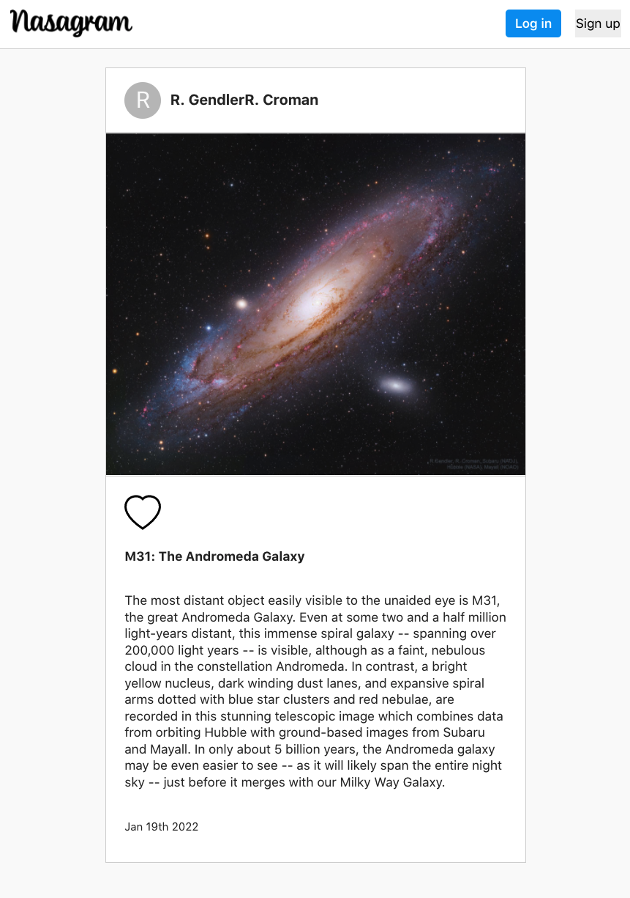
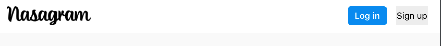

# Nasagram - NASA's Astronomy Picture of the Day

Welcome to NASA's next conquest - the social media space. With [Nasagram](https://nasagram1.herokuapp.com/), users will be able to view the day's [APOD](https://apod.nasa.gov/apod/astropix.html) in a fresh (somewhat) new way! Users will be able to leave likes as well.

## Making of Nasagram

Using NASA's [APOD API](https://api.nasa.gov/), we can view the day's image of the day. Each day will be a different image.
The following technologies and libraries were used to make our app.

- React
- JavaScript
- HTML
- CSS
- [Axios](https://www.npmjs.com/package/axios)
- [Material UI](https://mui.com/)
- [React-Heart](https://github.com/matthewgferrari/react-heart)
- [MomentJS](https://momentjs.com/)

## Stretch Goals

Nasagram is still in its early stages for now, but eventually we would like to add user authentication so sign in and sign up, ideally with Firebase.

## How to Launch

To launch the app, you can simply view it [here](https://nasagram1.herokuapp.com/), or you can clone this repo and use 

``
npm start
``